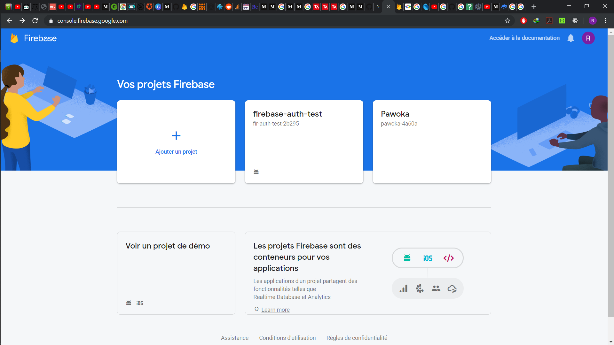
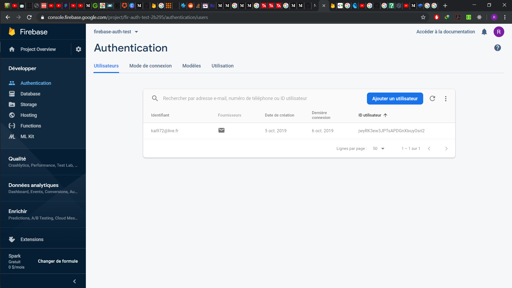
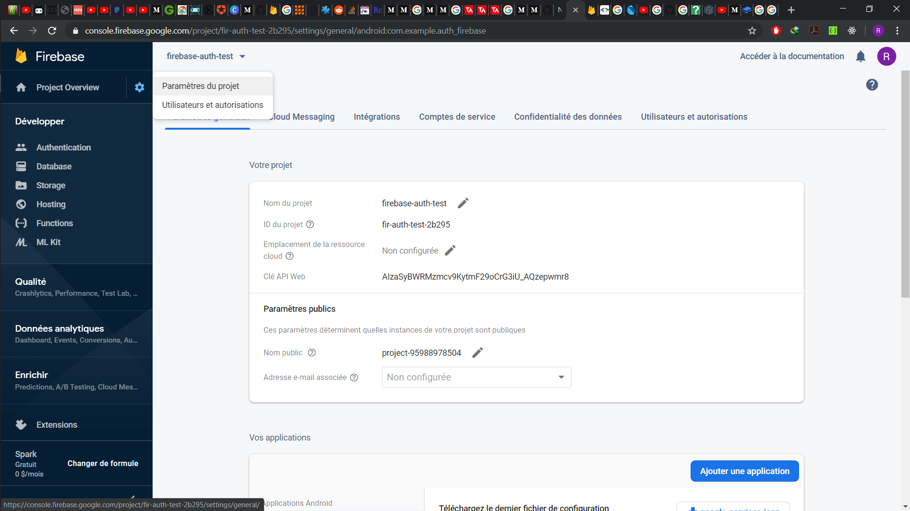

# FireBase

> Configuration du projet sur firebase

## Initialisation

Pour utiliser les service de firebase auth, il faut créer un projet sur firebase console (ça implique de disposer d'un compte firebase)
[https://console.firebase.google.com/](https://console.firebase.google.com/)

Suivre les étapes pour générer le projet

> Création du projet



> Page après projet créer



Sur l'onglet Authentification,  Choisir mode de connexion

> Choisir les méthodes qui interessent


### Utilisation de firebase database

Pour ce projet, nous allons utiliser aussi une base données firebase
Pour ça, ont va sur l'onglet database et on en crée une
Plus d'info sur Firecloud database dans son tuto dédié

### Finalisation des configurations

Ensuite aller dans project overview puis parametres du projet

> Parametres du projet



Sur cette page, on pourra configurer notre application pour android/ios/web
On rempli les champs obligatoire puis on clique sur le bouton "ajouter une application"
**NB**: A partir du moment où google auth est choisi, il faut rentré une clé sha-1 générer sur le pc du testeur (les manip sont expliquer sur la page)

Une fois le bouton ajouté une application cliqué
Suivre les instruction de google pour les platteform correspondantes
Cela permet d'initialiser le'application pour fonctionner avec les différents services Google

###### Pour android

Dans le build.gradle, contrairement a ce que google il faut mettre cette version

```
    classpath 'com.google.gms:google-services:3.2.1'
```

La version indiqué par google n'est pas encore compatible avec flutter
Le fichier json va dans le dossier android/app