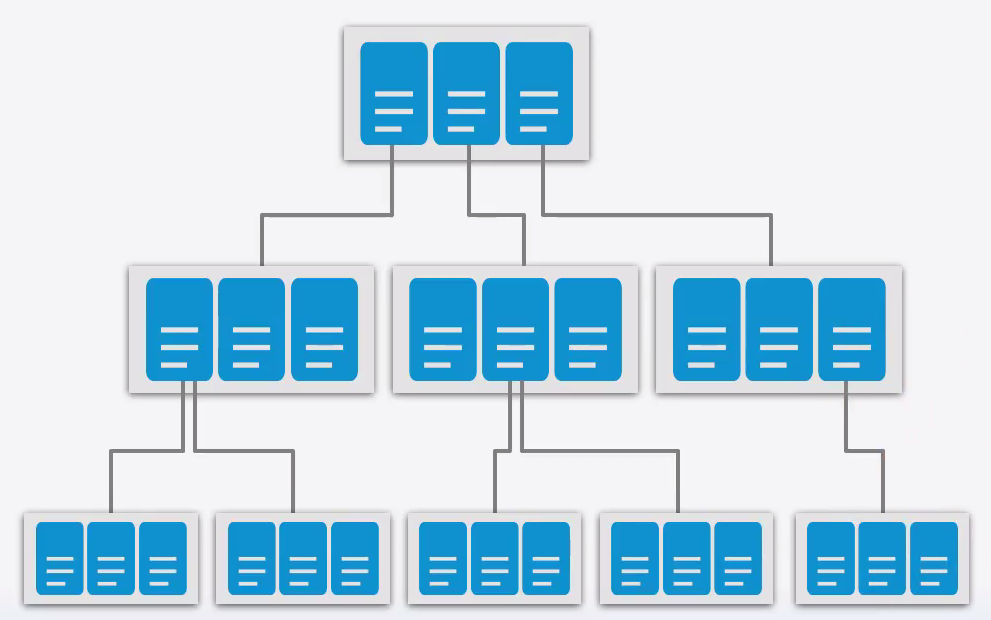

# Firebase Database (FIRESTORE)

> Intro à la gestion des données via firebase database

## Introduction

Firestore utilise un systeme de collection pour enregistrer ses données

Une collection est un ensemble de données qui peuvent contenir des sous ensembles qui peuvent eux meme en contenir



Exemple: 
on enregistre un utilisateur dans une table "users", on aura une collection sous-jacente qui aura ses adresses. on y accédera comme suit : users/{uid}/adress

### Prérequis

###### Android X

Afin de pouvoir utiliser les service de google, il faut impérativement une application flutter sous androidX

```dart
    flutter create --androix project_name
```

###### Avoir générer un projet sur firebase

[Firebase](firebase.md)

Ajouter le package correspondant dans le pupscec.yaml

```yaml
    cloud_firestore:  ^0.12.9+5
```

## Exemple CRUD

```dart
    import 'package:cloud_firestore/cloud_firestore.dart';

class Bidon {
    Bidon();
    
    _createOrUpdate(<dynamic> data) async {
      ///on crée une instance de firestore
      return await Firestore.instance
          .collection('bidon') ///on choisi la collection (table) 
          .document(data.id) ///la condition pour la requete
          .setData({ ///setData creer un enregistrement s'il n'existe pas ou le met a jour s'il existe
             property : value,
            });
    }
    
    _getOne(<dynamic> data) async {      
      return await Firestore.instance
        .collection('bidon')
        .document(data.id)
        .snapshots();
    }
    
    _getAll(<dynamic> data) async {      
      return await Firestore.instance
        .collection('bidon')
        .snapshots();
    }
    
    _deleteOne(<dynamic> data) async {      
      return await Firestore.instance
        .collection('bidon')
        .document(data.id)
        .delete();
    }
}
```