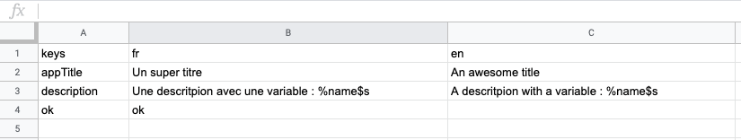

# i18n

> Comment internationaliser flutter sans se faire chier ni oublier des traductions

## Récupérer les package sur pub

Dans le pubspec.yaml

```yaml
flutter_localizations:
    sdk: flutter
    
dev_dependencies:
  flappy_translator: ^1.0.3
```

Dans la console

```dart
flutter pub get
```

## Générer un fichier CSV

##### Pourquoi un csv ?

On pourrais générer des fichier json et les copier coller, pour avoir les entré pis après rajoutes les entré manquante a la main... mais.... non trop de souffrance de facilité de négliger des traductions.
Le csv nous permet d'avoir un tableau claire de suivre nos traduction sans trop de problème.
De plus, avec le plugin utilisé, nous n'avons pas a gérer les classes, et variables, etc... pour notre application, une commande magique les génère pour nous

Au choix, on crée le fichier dans excel ou libre office ou autres sinon dans vscode on créer un nouveau fichier avec extension cvs
Le séparateur du csv devra être la virgule

##### Dans le cas d'une généation avec vscode

Il existe des extensions sympa pour manipuler les csv directement dans vscode

Rainbow CSV : pour distinguer les colonnes via des couleur (pour une lecture en plain-text du csv)
Edit CSV: pour avoir une vue du csv comme dans excel (avec édition)


##### Structure du CSV final



La première ligne contient les codes des langues de notre app; la colonne B est la langue par défaut de notre application, cet ordre est très important

## Nos premières traductions

Une fois le fichier générer, par soucis de clarté, nous allons le mettre dans le dossier assets/i18n
Ce fichier n'a pas besoin d'être exposer dans le pub.yaml, il ne sera utilisé que pour avoir une liste claire de nos traductions
Dans la console:


```dart
///schema basique
flutter pub run flappy_translator path/to/file.csv path/to/export/class_with_translation

///schema de notre app
flutter pub run flappy_translator assets/i18n/translation.csv lib/i18n
```

Cette commande va générer un fichier i18n.dart dans le dossier lib/i18n
Dedans on y trouve  une classe
- i18n : qui va contenir nos différentes clé pour traduction, les locales disponible, la locale acruel et les assesseurs de nos clé
- i18nDeleagate: qui va permettre d'exposer nos traduction dans l'application


## Mise en plae dans l'application

Dans le fichier main.dart:


```dart
class MyApp extends StatelessWidget {
  @override
  Widget build(BuildContext context) {
    return MaterialApp(
      localizationsDelegates: [
        const I18nDelegate(),
        GlobalMaterialLocalizations.delegate,
        GlobalWidgetsLocalizations.delegate,
      ],
      supportedLocales: [
        const Locale('en', ''),
        const Locale('fr', ''),
      ],
      home: Home(),
    );
  }
}
```
Exemple d'utilisation

```dart
class Home extends StatelessWidget {
  @override
  Widget build(BuildContext context) {
    return Scaffold(
      body: SafeArea(
        child: Center(
          child: Column(
            children: <Widget>[
              Text(I18n.of(context).appTitle),
              Text(I18n.of(context).description(age: 25,)),
              Text(I18n.of(context).ok),
            ],
          ),
        ),
      ),
    );
  }
}
```

Source:  [https://blog.smartnsoft.com/flutter-internationalization-the-easy-way-with-flappy-translator-ef1e9e80ec58](https://blog.smartnsoft.com/flutter-internationalization-the-easy-way-with-flappy-translator-ef1e9e80ec58)

