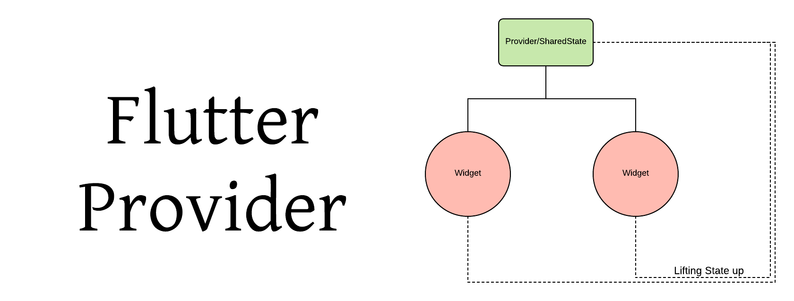
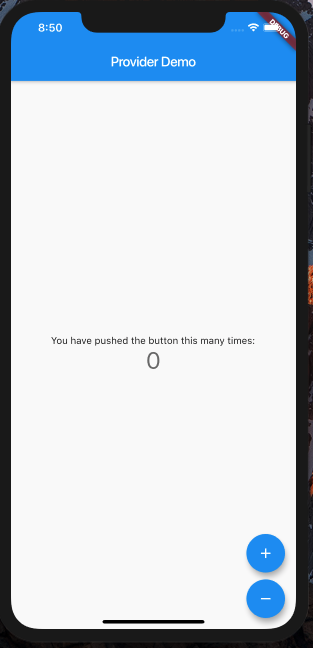
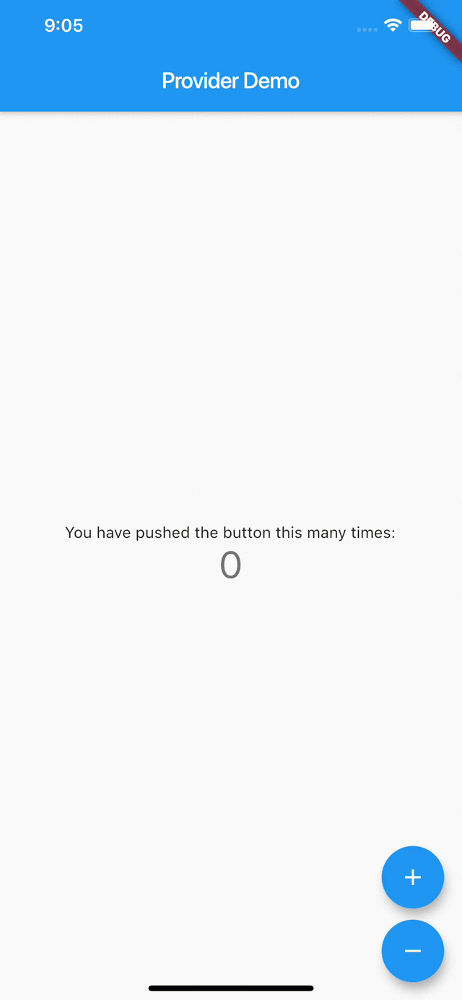

# Providers



## Qu'est ce que Provider?

Provider est un package qui permet la gestion d'état

Pour l'utiliser , on renseigne dans le pubspect.yaml

```yaml
provider: ^2.0.0+1 // as of now
```

On crée notre projet flutter

```dart
import 'package:flutter/material.dart';

void main() => runApp(MyApp());

class MyApp extends StatelessWidget {
  @override
  Widget build(BuildContext context) {
    return MaterialApp(
      title: 'Flutter Demo',
      theme: ThemeData(
        primarySwatch: Colors.blue,
      ),
      home: HomePage(),
    );
  }
}

class HomePage extends StatelessWidget {
  @override
  Widget build(BuildContext context) {
    int _counter = 0;
    return Scaffold(
      appBar: AppBar(
        title: Text("Provider Demo"),
      ),
      body: Center(
        child: Column(
          mainAxisAlignment: MainAxisAlignment.center,
          children: <Widget>[
            Text(
              'You have pushed the button this many times:',
            ),
            Text(
              '$_counter',
              style: Theme.of(context).textTheme.display1,
            ),
          ],
        ),
      ),
      floatingActionButton: Column(
        mainAxisAlignment: MainAxisAlignment.end,
        children: <Widget>[
          FloatingActionButton(
            onPressed: () {},
            tooltip: 'Increment',
            child: Icon(Icons.add),
          ),
          SizedBox(height: 10),
          FloatingActionButton(
            onPressed: () {},
            tooltip: 'Increment',
            child: Icon(Icons.remove),
          )
        ],
      ),
    );
  }
}
```



Maintenant pour utiliser provider , on va crée une class Counter et deux méthodes increment et decrement

```dart
import 'package:flutter/material.dart';

class Counter with ChangeNotifier {
  int _counter;

  Counter(this._counter);

  getCounter() => _counter;
  setCounter(int counter) => _counter = counter;

  void increment() {
    _counter++;
    notifyListeners();
  }

  void decrement() {
    _counter--;
    notifyListeners();
  }
}
```

> On étant de la class ChangeNotifier qui va rajouter un écouteur à notre class

```dart
notifyListeners(); // il notifie l'auditeur et met à jour l'interface utilisateur.
```

Sachant qu'on flutter fonctionne en arbre , on va placer notre Counteur dans la HomePage 

```dart
home: ChangeNotifierProvider<Counter>(
    builder: (_) => Counter(0),
    child: HomePage(),
)
```

> builder sera l'objet ou nous instancions la classe . N’oubliez pas de placer votre classe dans le &lt;&gt; car il s’agit d’un widget générique et de le donner à l’enfant.

Maintenant que le widget est dans l'arbre on peut accéder à l'objet de deux manières. Soit en utilisant Provider.of\(context\) or Consumer Widget

```dart
class HomePage extends StatelessWidget {
  @override
  Widget build(BuildContext context) {
    final counter = Provider.of<Counter>(context);
    return Scaffold(
      appBar: AppBar(
        title: Text("Provider Demo"),
      ),
      body: Center(
        child: Column(
          mainAxisAlignment: MainAxisAlignment.center,
          children: <Widget>[
            Text(
              'You have pushed the button this many times:',
            ),
            Text(
              '${counter.getCounter()}',
              style: Theme.of(context).textTheme.display1,
            ),
          ],
        ),
      ),
      floatingActionButton: Column(
        mainAxisAlignment: MainAxisAlignment.end,
        children: <Widget>[
          FloatingActionButton(
            onPressed: counter.increment,
            tooltip: 'Increment',
            child: Icon(Icons.add),
          ),
          SizedBox(height: 10),
          FloatingActionButton(
            onPressed: counter.decrement,
            tooltip: 'Increment',
            child: Icon(Icons.remove),
          )
        ],
      ),
    );
  }
}
```



