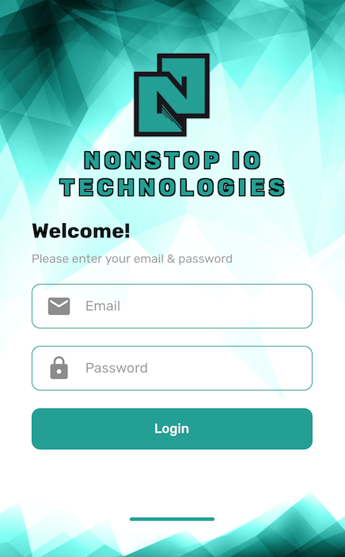

# Flutter Responsive

Librairie a utilisé :  [https://pub.dev/packages/flutter\_screenutil](https://pub.dev/packages/flutter_screenutil)



```dart
Container(
  margin: EdgeInsets.only(top: 50.0),
  padding: EdgeInsets.all(10.0),
  child: Image(
    image: AssetImage('assets/logo.png'),
    height: 120.0,
    width: 120.0,
    fit: BoxFit.contain,
  ),
),Container(
  padding: EdgeInsets.symmetric(horizontal: MediaQuery.of(context).size.width / 10),
  child: Text(
    "NONSTOP IO TECHNOLOGIES",
    style: TextStyle(
      fontFamily: 'Rubik-Bold',
      fontSize: 26.0,
      color: Color(0xFF008482),
      shadows: [
        Shadow(
            // bottomLeft
            offset: Offset(-1.5, -1.5),
            color: Colors.black),
        Shadow(
            // bottomRight
            offset: Offset(1.5, -1.5),
            color: Colors.black),
        Shadow(
            // topRight
            offset: Offset(1.5, 1.5),
            color: Colors.black),
        Shadow(
            // topLeft
            offset: Offset(-1.5, 1.5),
            color: Colors.black),
      ],
      letterSpacing: 5.0,
      inherit: false,
    ),
    textAlign: TextAlign.center,
  ),
)
```

```dart
Container(
  decoration: BoxDecoration(
      border: Border.all(
        color: Color(0xFF18a096),
      ),
      borderRadius: BorderRadius.all(Radius.circular(10.0))),
  padding: EdgeInsets.all(15.0),
  child: TextFormField(
    decoration: InputDecoration(
      icon: Icon(
        Icons.email,
        size: Constant.texIconSize,
      ),
      hintText: "Email",
      hintStyle: TextStyle(
        fontFamily: 'Rubik-Regular',
        fontSize: 16.0,
        color: Colors.grey,
        inherit: false,
      ),
      errorStyle: TextStyle(
        fontFamily: 'Rubik-Light',
        fontSize: 12.0,
        color: Colors.red,
        inherit: false,
      ),
      errorMaxLines: 1,
      contentPadding: EdgeInsets.zero,
      border: InputBorder.none,
    ),
    style: TextStyle(
      fontFamily: 'Rubik-Regular',
      fontSize: 16.0,
      color: Colors.black,
      inherit: false,
      textBaseline: TextBaseline.alphabetic,
      letterSpacing: 3.0,
    ),
  ),
)
```

```dart
InkWell(
  borderRadius: BorderRadius.all(
    Radius.circular(10.0),
  ),
  onTap: () {},
  child: Container(
    padding: EdgeInsets.all(15.0),
    child: Center(
      child: Text(
        "Login",
        style: TextStyle(
          fontFamily: "Rubik-Medium",
          fontSize: 15.0,
          color: Colors.white,
          inherit: false,
        ),
      ),
    ),
    decoration: BoxDecoration(
      color: Color(0xFF18a096),
      borderRadius: BorderRadius.all(
        Radius.circular(10.0),
      ),
    ),
  ),
)
```

Une fois la formulaire de contact créer un problème viendra 


Pour régler le problème, on utilisera la librairie ScreenUtils

Dans le pubspec.yaml


Ensuite on devra instancier l'objet screenUtil

```dart
@override
Widget build(BuildContext context) {  double defaultScreenWidth = 400.0;
  double defaultScreenHeight = 810.0;  ScreenUtil.instance = ScreenUtil(
    width: defaultScreenWidth,
    height: defaultScreenHeight,
    allowFontScaling: true,
  )..init(context);

  return SafeArea(...
```

> Les tailles default sont definis par rapport à un ecran 4 pouces donc il faut que le design soit fait avec une référence d'un écran 4 pouces

Enfin, remplacer nos valeurs 

```dart
Container(
  margin: EdgeInsets.only(top: ScreenUtil.instance.setWidth(50.0)),
  padding: EdgeInsets.all(ScreenUtil.instance.setWidth(10.0)),
  child: Image(
    image: AssetImage('assets/logo.png'),
    height: ScreenUtil.instance.setHeight(120.0),
    width: ScreenUtil.instance.setHeight(120.0),
    fit: BoxFit.contain,
  ),
),
Container(
  padding: EdgeInsets.symmetric(horizontal: ScreenUtil.instance.width / 10),
  child: Text(
    "NONSTOP IO TECHNOLOGIES",
    style: TextStyle(
      fontFamily: 'Rubik-Bold',
      fontSize: ScreenUtil.instance.setSp(26.0),
      color: Color(0xFF008482),
      shadows: [
        Shadow(
            // bottomLeft
            offset: Offset(-1.5, -1.5),
            color: Colors.black),
        Shadow(
            // bottomRight
            offset: Offset(1.5, -1.5),
            color: Colors.black),
        Shadow(
            // topRight
            offset: Offset(1.5, 1.5),
            color: Colors.black),
        Shadow(
            // topLeft
            offset: Offset(-1.5, 1.5),
            color: Colors.black),
      ],
      letterSpacing: 5.0,
      inherit: false,
    ),
    textAlign: TextAlign.center,
  ),
)
```

Le résultat obtenu sera


